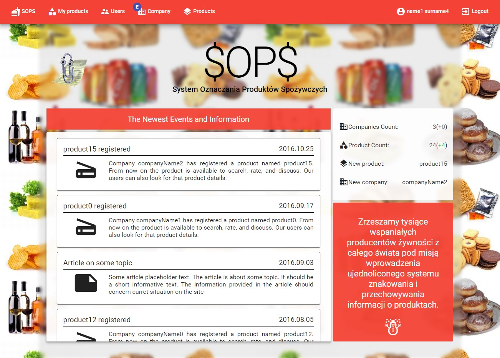
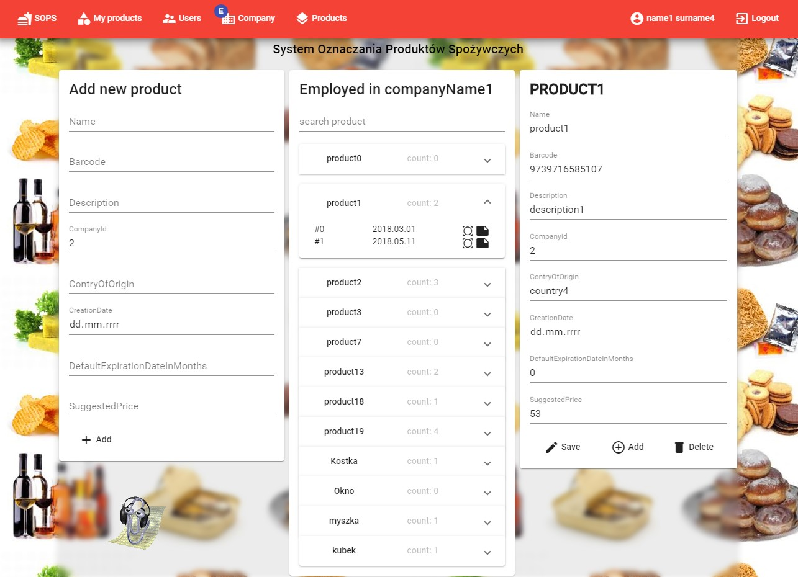
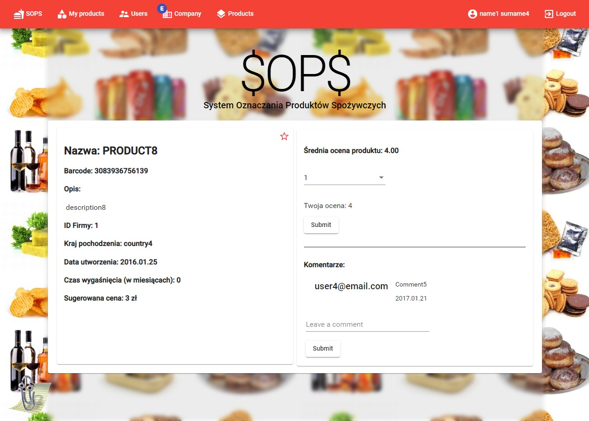
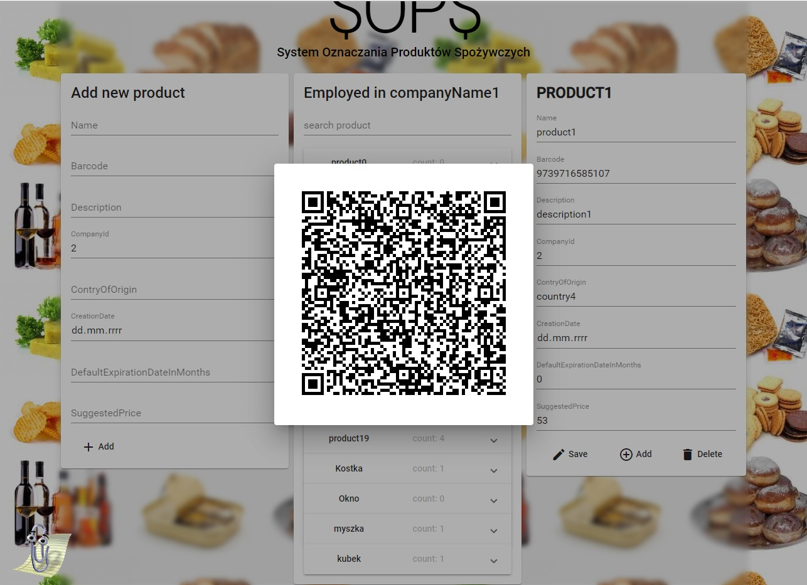
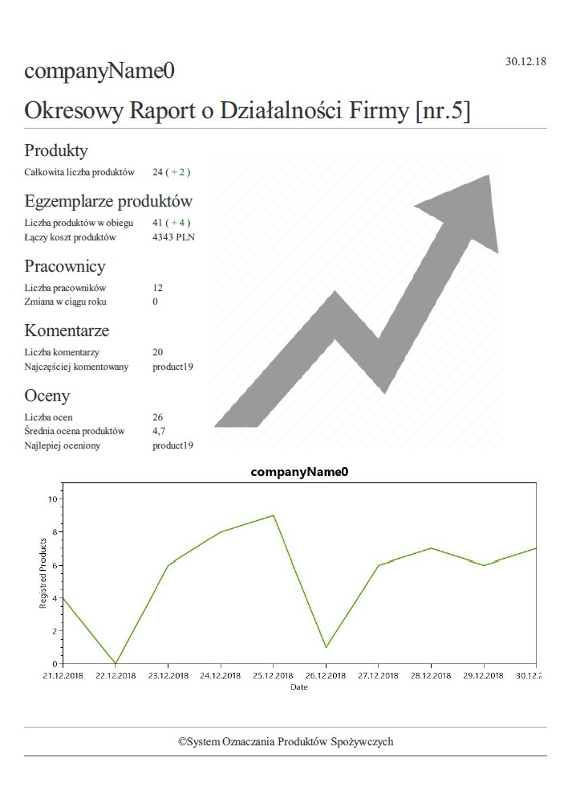
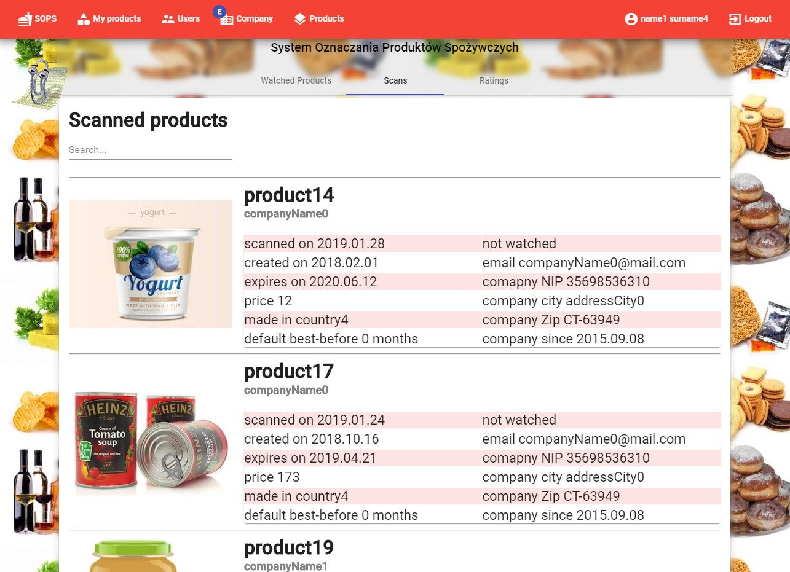
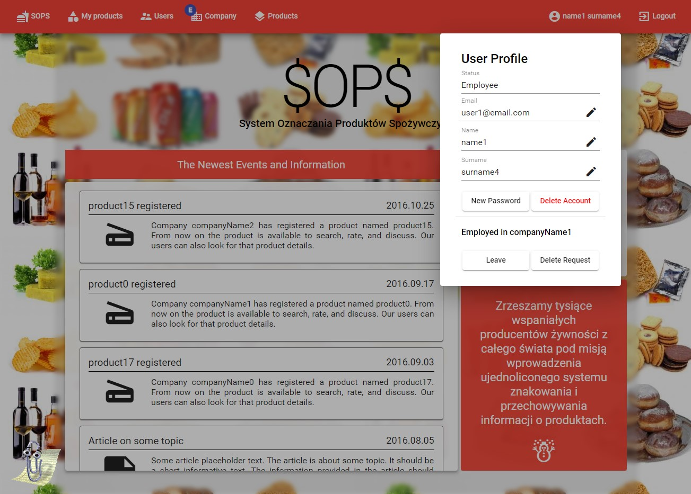
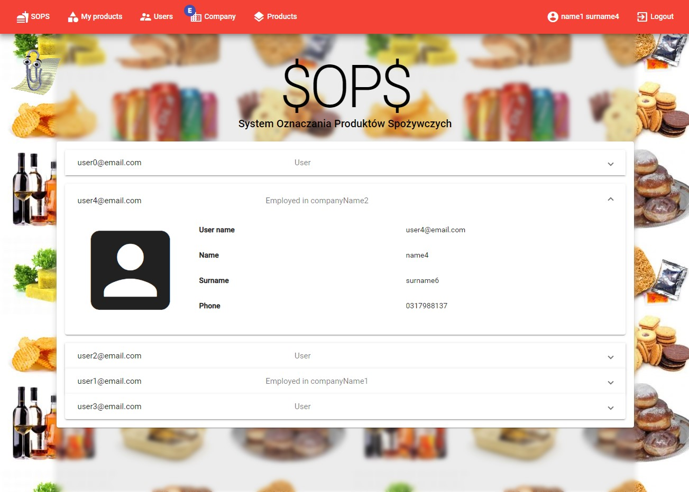

# Sops / System oznaczeń produktów spożywczych (Produkt marking system)
Authors:
- Paweł Antoniuk
- Oskar Dadan
- Michał Szewczak

# Frontend
Angular 2+ Front-End Project with ASP WebApi on Back-End. Android app made by Oskar Dadan.

# Backend
https://github.com/michasacuer/sops-back

# Android app (Oskar Dadan)
https://github.com/Niekarp/sops-android

# Key features

- read about new events on homepage
- register products
- generate QR codes
- download pdf with product summary
- receive periodic emails with period summary
- browse registered users, companies and their products
- rate, comment and add products to favourites
- see code scan history
- manage your account
- admin panels

# Photos
  

